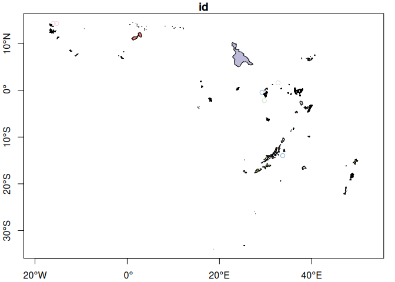

<!-- README.md is generated from README.Rmd. Please edit that file -->

# wheredd

<!-- badges: start -->

[](https://github.com/belian-earth/wheredd/actions/workflows/R-CMD-check.yaml)
[](https://app.codecov.io/gh/belian-earth/wheredd)
[](https://www.apache.org/licenses/LICENSE-2.0)
[](https://cran.r-project.org/package=vrtility)

<!-- badges: end -->

**wheredd** is an R package that provides streamlined access to forest
carbon project boundary data. The package builds a local DuckDB database
from the [CECIL forest carbon boundaries
dataset](https://source.coop/cecil/forest-carbon-boundaries), making it
easy to query and analyze REDD+ and carbon offset project locations.

**This package focuses on data access.** Once you have the data, use
standard R spatial and data analysis tools (sf, dplyr, terra, etc.) for
your analysis workflows.

## Installation

Install the development version from GitHub:

``` r
# install.packages("pak")
pak::pak("belian-earth/wheredd")
```

## Quick Start

### Just get the urls:

``` r
library(wheredd)

# just get the urls and download yourself...
carbon_proj_release_url()
#> [1] "https://github.com/belian-earth/wheredd/releases/download/v0.2.0/forest_carbon_boundaries.parquet"
# or for access to the original source data urls...
carbon_proj_source_urls()
#> https://data.source.coop/cecil/forest-carbon-boundaries/africa.parquet
#> https://data.source.coop/cecil/forest-carbon-boundaries/asia.parquet
#> https://data.source.coop/cecil/forest-carbon-boundaries/europe.parquet
#> https://data.source.coop/cecil/forest-carbon-boundaries/north_america.parquet
#> https://data.source.coop/cecil/forest-carbon-boundaries/oceania.parquet
#> https://data.source.coop/cecil/forest-carbon-boundaries/south_america.parquet
```

### Read directly from source

{duckplyr} probably provides the simplest and most familiar (to R users)
way to access the data, but you can also read the parquet files directly
with arrow or other tools if you prefer.

``` r
library(duckplyr)

read_parquet_duckdb(
  carbon_proj_release_url()
) |>
  filter(continent == "europe")
#> # A duckplyr data frame: 16 variables
#>   id     project_name area_role registry_name methodology project_type continent
#>   <chr>  <chr>        <chr>     <chr>         <chr>       <chr>        <chr>    
#> 1 VCS25… ACAP Albani… project   Verra         AR-ACM0003  ARR          europe   
#> 2 VCS25… ACAP Albani… accounti… Verra         AR-ACM0003  ARR          europe   
#> 3 VCS33… Westphalen … project   Verra         VM0012      IFM          europe   
#> 4 VCS23… Rotunda For… project   Verra         VM0012      IFM          europe   
#> # ℹ 9 more variables: country <chr>, project_developer <chr>,
#> #   project_start_date <date>, project_end_date <date>, entry_date <date>,
#> #   processing_approach <chr>, pd_declined <chr>, filename <chr>,
#> #   geometry <list>
```

### Create local database

There is also a helper function to create a local DuckDB database for
more complex queries and spatial operations. This will download the
data, process geometries, and create an optimized database file on your
machine.

``` r
library(DBI)
library(duckdb)
# Create local database
db_path <- carbon_proj_db()

# Connect to database
con <- dbConnect(duckdb(), dbdir = db_path, read_only = TRUE)

# Query with SQL via DBI
projects <- dbGetQuery(con, "
  SELECT * FROM carbon_projects
  WHERE continent = 'africa' AND area_role = 'project'
  LIMIT 10
")

# Or use d(uck)plyr
projects <- read_sql_duckdb("SELECT * FROM carbon_projects", con =  con) |>
  filter(continent == "africa", area_role == "project") |> 
  collect()

projects
#> # A tibble: 72 × 16
#>    id    project_name area_role registry_name methodology project_type continent
#>    <chr> <chr>        <chr>     <chr>         <chr>       <chr>        <chr>    
#>  1 VCS2… Pendjari an… project   Verra         VM0009      AD           africa   
#>  2 VCS2… Forest Cons… project   Verra         VM0010      IFM          africa   
#>  3 VCS2… Chinko Cons… project   Verra         VM0009      AD           africa   
#>  4 GS56… EcoMakala V… project   Gold Standard Gold Stand… ARR          africa   
#>  5 VCS1… Isangi REDD… project   Verra         VM0006      AD           africa   
#>  6 VCS9… The Mai Ndo… project   Verra         VM0009      AD           africa   
#>  7 GS10… Humbo Ethio… project   Gold Standard AR-AM0003   ARR          africa   
#>  8 GS30… Soddo Commu… project   Gold Standard Gold Stand… ARR          africa   
#>  9 VCS1… Bale Mounta… project   Verra         VM0015      AD           africa   
#> 10 GS11… JOil Jatrop… project   Gold Standard Gold Stand… ARR          africa   
#> # ℹ 62 more rows
#> # ℹ 9 more variables: country <chr>, project_developer <chr>,
#> #   project_start_date <date>, project_end_date <date>, entry_date <date>,
#> #   processing_approach <chr>, pd_declined <chr>, filename <chr>,
#> #   geometry <list>

dbDisconnect(con, shutdown = TRUE)
```

### Geometries are fully compatible with sf/gdal/QGIS

The WKB geometries can be directly interpreted by sf on read so
converting to an sf object is straightforward (FYI you can also just
download the file parquet file and drop it into QGIS):

``` r
library(sf)

# Read WKB geometry column as sf
projects_sf <- projects |>
  st_as_sf(crs = 4326)

# Now use standard sf operations
plot(projects_sf['id'], axes=TRUE)
```



### Build from source

For fresh data with full geometry processing:

``` r
# Build from source parquet files (slower, but fresh)
db_path <- carbon_proj_db(
  build_from = "source",
  continents = c("africa", "asia")
)
```

## Data Structure

The database contains one table (`carbon_projects`) with:

- **One row per project per area type** (project, accounting, reference)
- **area_role**: Type of boundary (project/accounting/reference)
- **geometry**: Geometry as WKB BLOB (use `sf::st_as_sf(wkb = ...)`)
- **Metadata**: Project name, registry, dates, country, etc.
- **Ordered by**: continent → country → id

## Data Source

Data is from the CECIL project’s forest carbon boundaries dataset:
<https://source.coop/cecil/forest-carbon-boundaries>

The package does not include analytical functions—it provides clean,
queryable access to the data. Use R’s rich ecosystem of spatial and
analytical packages for your analysis needs.

## Data Dictionary

The `carbon_projects` table contains the following columns:

| Column | Type | Description |
|----|----|----|
| `id` | VARCHAR | Unique project identifier combining registry abbreviation and project number (e.g., “VCS1234”) |
| `project_name` | VARCHAR | Name of the carbon project as documented by the registry |
| `area_role` | VARCHAR | Type of boundary geometry: “project” (implementation area), “accounting” (area for credit calculation), or “reference” (area for baseline trends) |
| `registry_name` | VARCHAR | Carbon registry hosting the project (American Carbon Registry, BioCarbon Registry, Climate Action Reserve, EcoRegistry, Gold Standard, Verra) |
| `methodology` | VARCHAR | Methodology used for project implementation (e.g., VM0015, ACR Methodology) |
| `project_type` | VARCHAR | Type of forestry carbon offset program: ARR (Afforestation/Reforestation), AD (Avoided Deforestation), IFM (Improved Forest Management) |
| `continent` | VARCHAR | Continent where the project is located (africa, asia, europe, north_america, oceania, south_america) |
| `country` | VARCHAR | Country where the project is located |
| `project_developer` | VARCHAR | Entity or individual organizing the carbon offset project |
| `project_start_date` | DATE | Start date of the crediting period |
| `project_end_date` | DATE | End date of the crediting period |
| `entry_date` | DATE | Date when project information was added to the source database |
| `processing_approach` | VARCHAR | Method used to obtain boundary data: “Official” (from project developer), “Georeferenced” (from documents), “Linear” (traced from maps), or “Method” (derived from methodology) |
| `pd_declined` | VARCHAR | Whether the project developer declined to provide geometry (Yes/No/N/A) |
| `filename` | VARCHAR | Source parquet file URL from which this record was read |
| `geometry` | BLOB | Well-Known Binary representation of the project boundary (convert to sf using `st_as_sf(wkb = "geometry", crs = 4326)`) |

> [!NOTE]
> - Each project may appear 1-3 times depending on available boundary types (project/accounting/reference areas)
> - Both point and polygon geometries are supported - polygons are extracted from geometry collections
> - Empty geometries are filtered out during database creation
> - All geometries are validated, forced to 2D (Z coordinates removed), and stored as WKB BLOBs
> - Data is ordered by continent → country → id.

## Original Data Info and Attributions:

**source**: <https://source.coop/cecil/forest-carbon-boundaries>

**Converted by:** Alex Logan

**Original Authors:** Akshata Karnik, Jack B. Kilbride, Tristan R.H.
Goodbody, Rachael Ross, Elias Ayrey (Corresponding Author)

**Date:** June 5, 2024

**License:** CC-BY 4.0 See <https://zenodo.org/records/11459391>
